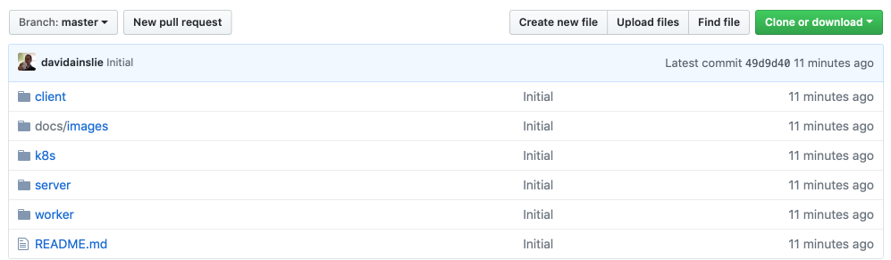
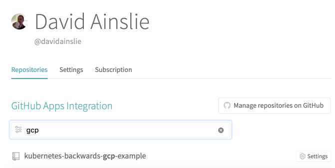
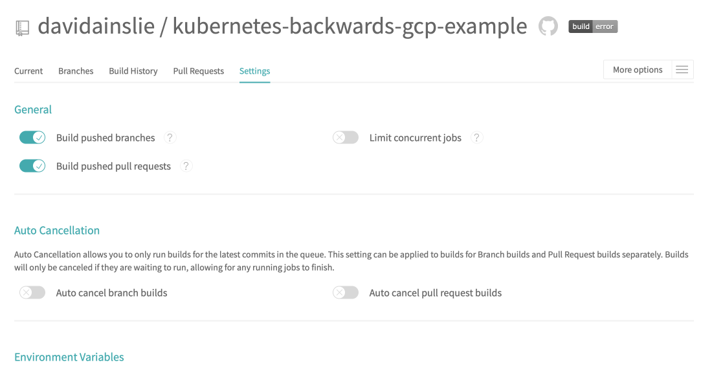
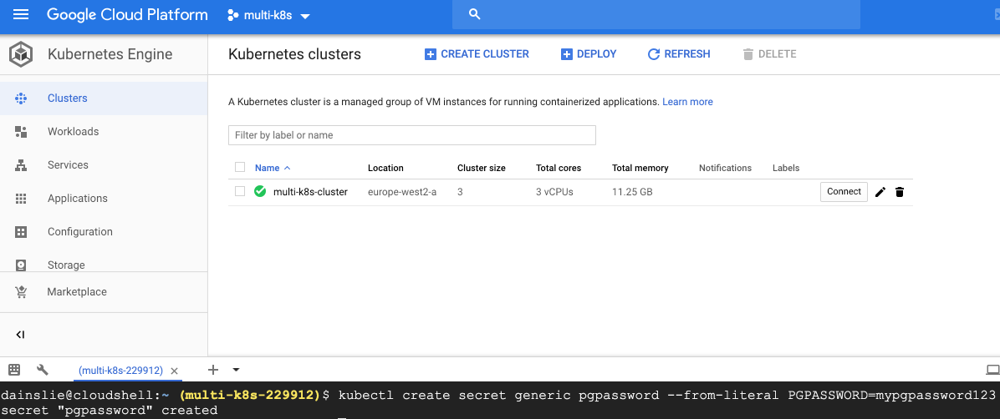
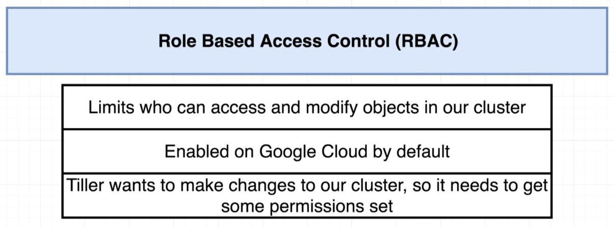

# Production

> 

---

> 

## Github

We create the [repository](https://github.com/davidainslie/multi-k8s):

> 

## Travis CI

On [Travis](https://travis-ci.com/) we sync with Github and then find our new repository:

> 

---

> 

# GCP

We need a Google cloud project, which we do via [console.cloud.google.com](https://console.cloud.google.com).

Create a new project:

> 

---

> 

---

> 

---

> 

## Kubernetes Cluster on GCP

> 

---

> 

---

> 

---

> 

## Travis Deployment to Kubernetes Cluster on GCP

> 

---

> 

#### Create a Service Account on GCP

> 

---

> 

---

> 

---

> 

---

> 

---

> 

#### Travis CLI to encrypt service account credentials in JSON

This is not relevant to Mac but since we are running stuff in containers, we can also avoid installing Ruby (which Mac already has) which is needed for the Travis CLI, by again using containers.

> 

---

> 

```bash
$ docker run -it -v $(pwd):/app ruby:2.3 sh

# ls
app  bin  boot	dev  etc  home	lib  lib64  media  mnt	opt  proc  root  run  sbin  srv  sys  tmp  usr	var

# cd app

# ls
README.md  client  docs  k8s  multi-k8s-service-account.json  server  worker

# gem install travis
...
17 gems installed
```

At this point, inside the image, we continue the same way we would without requiring said image i.e. if we are running on Mac and travis was already installed via homebrew as per the [setup](../../../docs/setup.md).

```bash
# travis login
Username: davidainslie
Password for davidainslie: ************
Two-factor authentication code for davidainslie: 517635
Successfully logged in as davidainslie!
```

```bash
# travis encrypt-file multi-k8s-service-account.json -r davidainslie/multi-k8s
encrypting multi-k8s-service-account.json for davidainslie/multi-k8s
storing result as multi-k8s-service-account.json.enc
storing secure env variables for decryption

Please add the following to your build script (before_install stage in your .travis.yml, for instance):

    openssl aes-256-cbc -K $encrypted_0c35eebf403c_key -iv $encrypted_0c35eebf403c_iv -in multi-k8s-service-account.json.enc -out multi-k8s-service-account.json -d

Pro Tip: You can add it automatically by running with --add.

Make sure to add multi-k8s-service-account.json.enc to the git repository.
Make sure not to add multi-k8s-service-account.json to the git repository.
Commit all changes to your .travis.yml.
```

```bash
# ls
README.md  client  docs  k8s  multi-k8s-service-account.json  multi-k8s-service-account.json.enc  server  worker
```

Any problems with the above, take a look at [https://github.com/travis-ci/travis-ci/issues/9668](https://github.com/travis-ci/travis-ci/issues/9668).

Once out of docker (and said image can be removed):

```bash
$ git add .

$ git commit -m "Added encrypted service account file"
```

#### Travis and Docker

> 

---

> 

---

> 

#### Deploy script

Our first attempt of [deploy.sh](./deploy.sh):

```sh
docker build -t davidainslie/multi-client -f ./client/Dockerfile ./client
docker push davidainslie/multi-client

docker build -t davidainslie/multi-server -f ./server/Dockerfile ./server
docker push davidainslie/multi-server

docker build -t davidainslie/multi-worker -f ./worker/Dockerfile ./worker
docker push davidainslie/multi-worker

kubectl apply -f k8s

kubectl set image deployments/server-deployment server=davidainslie/multi-server
kubectl set image deployments/worker-deployment worker=davidainslie/multi-worker
kubectl set image deployments/client-deployment client=davidainslie/multi-client
```

Is there an issue here?

> 

We need *new image versions* in order to have them applied to the cluster.

> 

How can we some sort of version automation?

> 

For every Git commit there is a SHA. A SHA essentially identifies all changes associated with its commit. To get the latest SHA:

```bash
production on master [⇡!?] at ☸️ minikube
➜ git rev-parse HEAD
48f14b6fb91b453a7772dac6e344a3c4c443e971
```

With this SHA, we can easily *debug* a broken deployment to Kubernetes:

> 

And why the two tags? Why still also tag with *latest*?

> 

Our [deployment script](./deploy.sh) is updated to:

```sh
docker build -t davidainslie/multi-client:latest -t davidainslie/multi-client:$SHA -f ./client/Dockerfile ./client
docker push davidainslie/multi-client:latest
docker push davidainslie/multi-client:$SHA

docker build -t davidainslie/multi-server:latest -t davidainslie/multi-server:$SHA -f ./server/Dockerfile ./server
docker push davidainslie/multi-server:latest
docker push davidainslie/multi-server:$SHA

docker build -t davidainslie/multi-worker:latest -t davidainslie/multi-worker:$SHA -f ./worker/Dockerfile ./worker
docker push davidainslie/multi-worker:latest
docker push davidainslie/multi-worker:$SHA

kubectl apply -f k8s

kubectl set image deployments/server-deployment server=davidainslie/multi-server:$SHA
kubectl set image deployments/worker-deployment worker=davidainslie/multi-worker:$SHA
kubectl set image deployments/client-deployment client=davidainslie/multi-client:$SHA
```

#### Secrets in GCP

We need to set up a secret for *PGPASSWORD*. Essentially we have to run the relevant kubectl command against our **mult-cluster** instance on GCP.

> 

---

> 

and we'll run the following commands to configure kubectl in our environment to allow running commands:

```bash
$ gcloud config set project multi-k8s-229912
Updated property [core/project].

$ gcloud config set compute/zone europe-west2-a
Updated property [compute/zone].

$ gcloud container clusters get-credentials multi-k8s-cluster
Fetching cluster endpoint and auth data.
kubeconfig entry generated for multi-k8s-cluster.
```

The above only has to be done once for a cluster (but has to be done again for any new cluster).

Now we can create said secret:

```bash
$ kubectl create secret generic pgpassword --from-literal PGPASSWORD=mypgpassword123
secret "pgpassword" created
```

> 

---

> 

#### Helm

Again, as with Minikube, we need to install an Ingress controller. [NGINX Ingress controller can be installed via Helm](https://kubernetes.github.io/ingress-nginx/deploy/#using-helm) using the chart [stable/nginx-ingress](https://github.com/kubernetes/charts/tree/master/stable/nginx-ingress) from the official charts repository.

> 

We issue commands to the CLI, Helm Client, which communicates with Tiller Server (a pod) running on our Kubernetes cluster.

The **setup** included installing Helm with Homebrew, but that won't help us here, now that our cluster is on GCP. So we'll following some instructions from the [Helm docs](https://docs.helm.sh/using_helm/#from-script). Run the following on the GCP shell:

```bash
$ curl https://raw.githubusercontent.com/helm/helm/master/scripts/get > get_helm.sh
  % Total    % Received % Xferd  Average Speed   Time    Time     Time  Current
                                 Dload  Upload   Total   Spent    Left  Speed
100  7236  100  7236    0     0  47909      0 --:--:-- --:--:-- --:--:-- 48240
```

```bash
$ chmod 700 get_helm.sh
```

```bash
$ ./get_helm.sh
Downloading https://kubernetes-helm.storage.googleapis.com/helm-v2.12.3-linux-amd64.tar.gz
Preparing to install helm and tiller into /usr/local/bin
helm installed into /usr/local/bin/helm
tiller installed into /usr/local/bin/tiller
Run 'helm init' to configure helm.
```

**DO NOT** run **helm init** just yet, since GCP needs some [extra setup](https://docs.helm.sh/using_helm/#gke) first - unlike a local environment.

> 

Note that locally with Minikube there is no RBAC.

> 

---

> 

Once again, in gcloud shell:

```sh
$ kubectl create serviceaccount --namespace kube-system tiller
serviceaccount "tiller" created
```

```sh
$ kubectl create clusterrolebinding tiller-cluster-rule --clusterrole=cluster-admin --serviceaccount=kube-system:tiller
clusterrolebinding.rbac.authorization.k8s.io "tiller-cluster-rule" created
```

```sh
$ helm init --service-account tiller --upgrade
Creating /home/dainslie/.helm
Creating /home/dainslie/.helm/repository
Creating /home/dainslie/.helm/repository/cache
Creating /home/dainslie/.helm/repository/local
Creating /home/dainslie/.helm/plugins
Creating /home/dainslie/.helm/starters
Creating /home/dainslie/.helm/cache/archive
Creating /home/dainslie/.helm/repository/repositories.yaml
Adding stable repo with URL: https://kubernetes-charts.storage.googleapis.com
Adding local repo with URL: http://127.0.0.1:8879/charts
$HELM_HOME has been configured at /home/dainslie/.helm.

Tiller (the Helm server-side component) has been installed into your Kubernetes Cluster.

Please note: by default, Tiller is deployed with an insecure 'allow unauthenticated users' policy.
To prevent this, run `helm init` with the --tiller-tls-verify flag.
For more information on securing your installation see: https://docs.helm.sh/using_helm/#securing-your-helm-installation
Happy Helming!
```

> 

#### Ingress Nginx with Helm

```sh
$ helm install stable/nginx-ingress --name my-nginx --set rbac.create=true
```

> 

---

> 

#### Let's actually deploy...

```bash
$ git add .
$ git commit -m "Deployment scripts"
$ git push
```

i.e. deployment is kicked off when Travis hook is triggered by Github.

> 

---

> 

#### Deploy a change

> 

```bash
$ git checkout -b devel
M       README.md
Switched to a new branch 'devel'

$ git add .

$ git commit -m "Update header"
[devel 5912da7] Update header
 5 files changed, 14 insertions(+), 2 deletions(-)
 create mode 100644 docs/images/deploy-a-change.png
 create mode 100644 docs/images/lets-see-the-app.png
 create mode 100644 docs/images/my-workloads.png
 
 $ git push --set-upstream origin devel
```

> 

## HTTPS

> 

So, a domain name is required e.g. from [domains.google.com](domains.google.com).

> 

Add new **custom records** with IP given by service i.e.

> 

---

> 

---

> 

Next up is [Cert Manager](github.com/jetstack/cert-manager) to automatically provision and manage [TLS certificates in Kubernetes](https://jetstack.io/). We enter the following into gcloud shell (taken from website):

```sh
# Install the CustomResourceDefinition resources separately
$ kubectl apply -f https://raw.githubusercontent.com/jetstack/cert-manager/release-0.6/deploy/manifests/00-crds.yaml

# Create the namespace for cert-manager
$ kubectl create namespace cert-manager

# Label the cert-manager namespace to disable resource validation
$ kubectl label namespace cert-manager certmanager.k8s.io/disable-validation=true

# Update your local Helm chart repository cache
$ helm repo update

# Install the cert-manager Helm chart
$ helm install \
  --name cert-manager \
  --namespace cert-manager \
  --version v0.6.1 \
  stable/cert-manager
```

